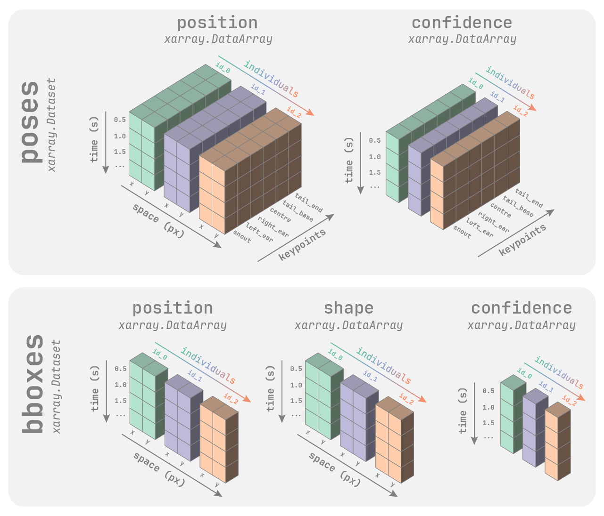

(target-dataset)=
# movement dataset

`movement` datasets are
[`xarray.Dataset`](xarray:generated/xarray.Dataset.html) objects, with some
added functionality for storing pose tracks and their derived quantities.
Each dataset contains multiple data variables, dimensions, coordinates and
attributes.

## Dimensions
The *movement dataset* has the following dimensions:
- `time`: the number of frames in the video
- `individuals`: the number of individuals in the video
- `keypoints`: the number of keypoints in the skeleton
- `space`: the number of spatial dimensions, either 2 or 3

Appropriate coordinate labels are assigned to each dimension:
list of unique names (str) for `individuals` and `keypoints`,
['x','y',('z')] for `space`. The coordinates of the `time` dimension are
in seconds if `fps` is provided, otherwise they are in frame numbers.

## Data variables

Right after loading some predicted pose tracks into `movement`, the dataset
contains two data variables stored as
[`xarray.DataArray`](xarray:generated/xarray.DataArray.html#xarray.DataArray)
objects:
- `position`: with shape (`time`, `individuals`, `keypoints`, `space`)
- `confidence`: with shape (`time`, `individuals`, `keypoints`)

You can think of a `DataArray` as a `numpy.ndarray` with `pandas`-style
indexing and labelling. To learn more about `xarray` data structures, see the
relevant [documentation](xarray:user-guide/data-structures.html).

## Attributes

Attributes are a dictionary-like object that is used to store metadata
about the dataset. Right after loading some predicted pose tracks into
`movement`, the dataset contains the following attributes:
- `fps`: the number of frames per second in the video
- `time_unit`: the unit of the `time` coordinates, frames or seconds
- `source_software`: the software from which the pose tracks were loaded
- `source_file`: the file from which the pose tracks were loaded
