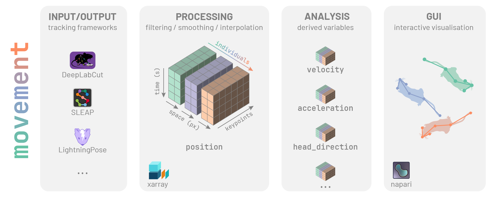

(target-movement)=
# movement

A Python toolbox for analysing body movements across space and time, to aid the study of animal behaviour in neuroscience.

::::{grid} 1 2 2 3
:gutter: 3

:::{grid-item-card} {fas}`rocket;sd-text-primary` Installation
:link: installation
:link-type: doc

How to install movement.
:::

:::{grid-item-card} {fas}`chalkboard-user;sd-text-primary` Tutorial
:link: tutorial
:link-type: doc

Learn the basics through a real-world example.
:::

:::{grid-item-card} {fas}`bullseye;sd-text-primary` How-to Guides
:link: examples/index
:link-type: doc

Examples using movement to complete specific tasks.
:::

:::{grid-item-card} {fas}`comments;sd-text-primary` Community
:link: community/index
:link-type: doc

Join the movement to get help and contribute.
:::

:::{grid-item-card} {fas}`book;sd-text-primary` Background
:link: background/index
:link-type: doc

Conceptual guides, explanations and terminology.
:::

:::{grid-item-card} {fas}`code;sd-text-primary` API Reference
:link: api_index
:link-type: doc

An index of all functions and classes.
:::

::::



## Overview

Pose estimation tools, such as [DeepLabCut](dlc:) and [SLEAP](sleap:) are now commonplace when processing video data of animal behaviour. There is not yet a standardised, easy-to-use way to process the *pose tracks* produced from these software packages.

movement aims to provide a consistent modular interface to analyse pose tracks, allowing steps such as data cleaning, visualisation and motion quantification.
We aim to support a range of pose estimation packages, along with 2D or 3D tracking of single or multiple individuals.

Find out more on our [mission and scope](target-mission) statement and our [roadmap](target-roadmap).

```{include} /snippets/status-warning.md
```

```{toctree}
:maxdepth: 2
:hidden:

installation
tutorial
examples/index
community/index
background/index
api_index
```
